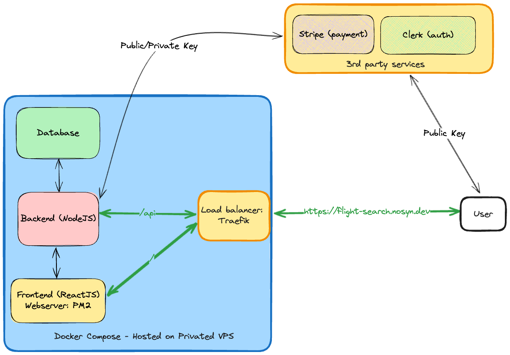

# Flight-search

# Features

- [x] Search Flights
- [x] Buy Tickets
- [x] Stripe Payment Integration
- [x] Clerk Auth Integration
- [x] Retrieve flight tickets
- [x] Basic role-based accesses
- [x] Logging with Morgan and Winston
- [x] Easy develop and deploy with Docker/Docker Compose

# How to set up locally

## Prerequisite

- Docker and Docker Compose
- NodeJS and NPM

## Running develop environment with docker

- Copy `.env.example` to `.env` in each folder `frontend` and `backend` and fill all the keys for Clerk and Stripe

- From root directory run following commands respectively (run the last scripts if you want to stop)

```sh
# To `run npm install` on backend and frontend folder
sh scripts/setup.sh

# To start up dev environment with docker, run
sh scripts/start-dev.sh

# To apply migration and seed mock data to database, run
sh scripts/seed.sh

# To stop all containers, run
sh scripts/clean-dev.sh
```

## Notes

- For payment, use mock data number from [Stripe Docs](https://docs.stripe.com/testing?testing-method=card-numbers#cards). Only accept MasterCard or Visa.

## Architect


